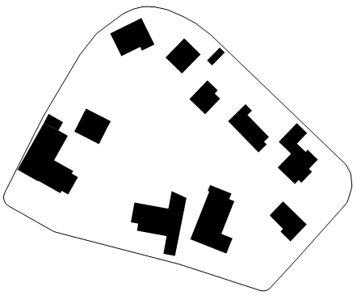

## ArchiBase
A City-scale Spatial Database for Architectural Research

---
ArchiBase allows indexing and geometric searching of the entire city. After the first setup, ArchiBase regularly updates itself with the latest data on the Internet, eliminating the need to retrieve the entire piece of data each time. The structure of the data table is flexible for applications and extensions for different cities. ArchiBase provides a framework in which researchers, architects, and technologists test the potentials of data-based algorithms.

Technically, ArchiBase uses JDBC to access a PostgreSQL database with extension plugins including PostGIS and HStore. The database
schemas which described the knowledge of ArchiBase, defined data tables in a spatial relational database. For adaptability, the users can alter table, add columns according their requirements.

### Features
- City Scale
- Spatial Query
- Version Control
- Coworking

### Environment
- Java 1.8+
You can check the version of Java is installed with the following command
``` bash
java -version
```
- [PostgreSQL 12](https://www.enterprisedb.com/downloads/postgres-postgresql-downloads) (Extenstion [PostGIS 3.0](http://download.osgeo.org/postgis/windows/))
Open Query tools in `pgAdmin`
``` SQL
CREATE EXTENSION postgis;

-- so do this in addition if you are experimenting PostGIS 3+
CREATE EXTENSION postgis_raster;
 
CREATE EXTENSION postgis_sfcgal;
CREATE EXTENSION address_standardizer;
CREATE EXTENSION fuzzystrmatch;
CREATE EXTENSION postgis_topology;
CREATE EXTENSION postgis_tiger_geocoder;
```
### Usage
#### Setup
Firstly, you need clone this repository and use your java IDE open it as a project;
``` bash
git clone git@github.com:Inst-AAA/archibase.git
```
then change the name of `InfoExample.java` to `Info.java` in direction `common/src/main/java/db` and modify the file with your infomation.

#### Aquire
ArchiBase mainly chooses OpenStreetMap as the data source; you can acquire data by using args of the bounding range of the city area
``` bash
java osm.OSMDownload "./data/wien" 48.110 16.152 48.324 16.625
```
POIs are directly enter into databse, with same command:
``` bash
java gmaps.GmapsRequest "./data/wien" 48.110 16.152 48.324 16.625
```
#### Worker
The worker generates the city blocks by dividing the LineString collection of the Road:
``` bash
java analysis.Generate "./data/wien.pbf"
```
It will generate file and name as `"./data/wien-cityblock.dxf"`  
You can also [download the boundary data of the city](osm-boundaries.com/) as an optional settings and name it as `"./data/wien-boundary.geojson"`  
After that, ArchiBase can automatically generate the whole city database:
``` bash 
java creator.Main "wien"
```
#### SQL examples
Here presents some examples for doing query geometry in the database:
##### Urban space 
##### Get all schools
``` SQL 
select geom, urban_spaces.name from urban_spaces, features where feature_id = features.id and features.name = 'school';
```
##### Buildings in city blocks 
``` SQL 
select buildings.id, ST_asGeoJSON(ST_Transform(buildings.geom,3785)), \
name, building_type, timestamp
from buildings, blocks
where blocks.id=11 and st_contains(ST_MakePolygon(blocks.geom), \
buildings.geom)
```


